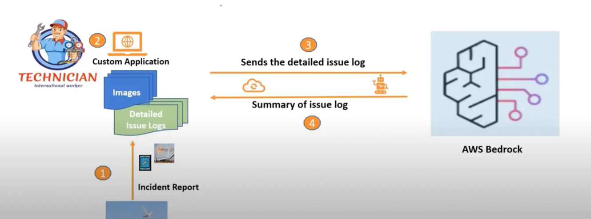

# AWS-Bedrock-streamlite-Chatbot-QA

### To install all libararies

```sh
python3 -m venv myenv
```

```sh
source myenv/bin/activate
```

```sh
pip install -r requirements.txt
```

```sh
pip install --upgrade pip
```


### To Run Streamlite Application


```
rag_env/bin/python -m streamlit run app.py
```


# Final Streamlite Website



